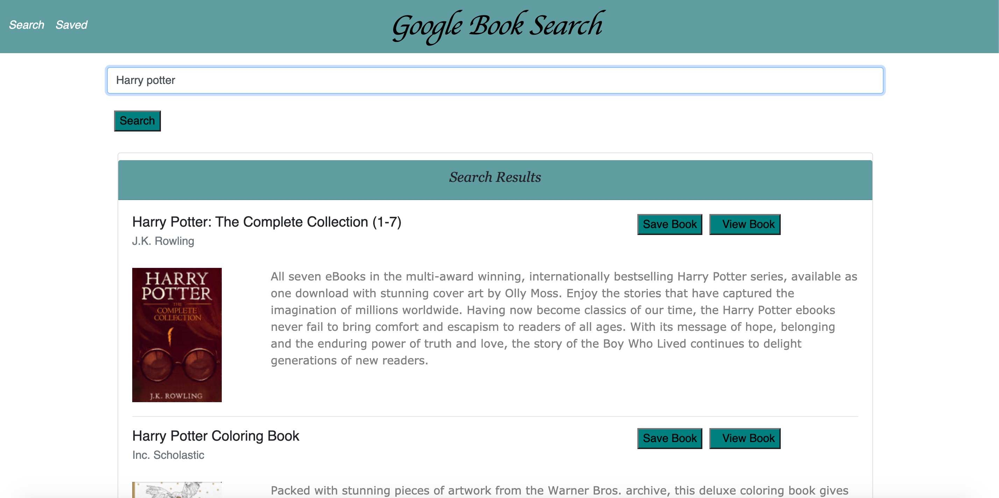
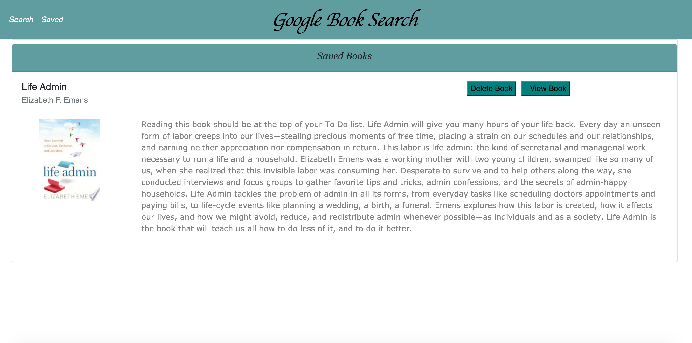

# GoogleBooks

[GoogleBooks](#GoogleBooks)
    - [Table of Contents](#table-of-contents)
  * [Summary](#summary)
  * [Pre-requisite](#pre-requisite)
  * [Demo](#demo)
  * [Technologyused](#technologyused-)
  * [Install](#install-)
  * [Contributor](#contributor)
  * [Codebase](#codebase)
  * [Application Walk-through](#Application-walk-through)

## Summary
  Create a new React-based Google Books Search app. This assignment requires you to create React components, work with helper/util functions, and utilize React lifecycle methods to query and display books based on user searches. You'll also use Node, Express and MongoDB so that users can save books to review or purchase later.

## Pre-requisite
Install NodeJS 

## Demo

## Technologyused:
<ul>
    <li> 
    <a href="https://reactjs.org/docs/getting-started.html" target="_blank">ReactJS  <a>
     
    </li>
    <li> 
    <a href="https://nodejs.org/en/docs/" target="_blank">NodeJS <a>
    </li>
     <li> 
    <a href="https://www.mongodb.com/" target="_blank">MongoDB <a>
    </li>
     <li> 
    <a href="https://expressjs.com/" target="_blank">ExpressJS <a>
    </li>
</ul>

## Install:
<strong>Code installation:</strong>  
$ cd [path_to_save_codebase]  
$ git clone https://github.com/arti-karnik/GoogleBooks 

<strong> Run the application: </strong>  
Open Terminal  
$ npm install  
$ npm start  
 
## Contributor
<strong> Github Profile: </strong>  
https://github.com/arti-karnik

<strong> Portfolio: </strong>  
https://arti-karnik.github.io/Portfolio-React/

## Codebase
https://github.com/arti-karnik/GoogleBooks

## Application Walk-through
<a href="https://whispering-everglades-55641.herokuapp.com/" target="_blank"> Click here for Application Live url </a>

